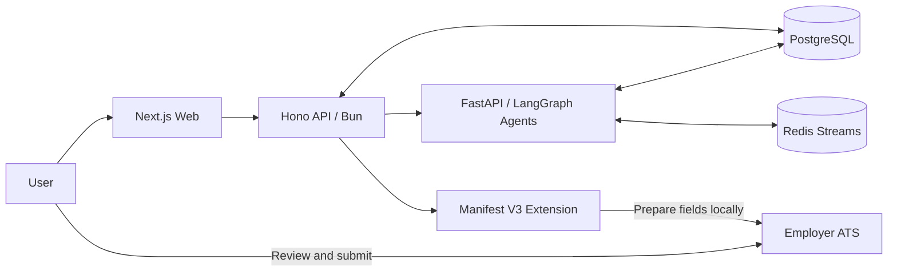

<div align="center">

# Relay

### Open-source infrastructure for an evidence-backed job search

**Let agents find roles, tailor materials, and prepare applications and interviews—while people retain control of the facts and the final submission.**

[](https://github.com/getyak/apply-agent/actions/workflows/ci.yml)
[](https://github.com/getyak/apply-agent/actions/workflows/secrets-scan.yml)
[](LICENSE)
[](web/package.json)
[](agents/pyproject.toml)

[Product tour](#product-tour) · [How it works](#how-it-works) · [Run locally](#run-locally) · [Architecture](#architecture) · [Documentation](docs/README.md)

</div>

<p align="center">
  
</p>

<p align="center">
  <sub>Recorded from the real product: Ask Vantage workspace → live matches → application review.</sub>
</p>

## What is Relay?

Relay is self-hostable infrastructure for an evidence-backed, agent-assisted job search. This repository contains the Next.js workspace, Hono API, FastAPI and LangGraph agents, PostgreSQL data layer, Redis event stream, and Manifest V3 browser extension.

The product interface in this repository is branded **Vantage**. Think of Relay as the open-source system and Vantage as the interface through which people use it.

Relay is deliberately not a spray-and-pray application bot. Agents take on the research and preparation; people keep control of irreversible decisions:

| Agents handle | People decide |
|---|---|
| Parse real career evidence and maintain a traceable Career Graph | Approve changes to career facts |
| Discover and rank relevant roles | Choose which opportunities deserve attention |
| Draft tailored résumés, cover letters, and form answers | Accept, edit, or reject every draft |
| Prepare ATS fields inside the browser | Click the final **Submit** button on the employer's site |
| Generate interview practice and follow-up suggestions | Record actual outcomes and feedback |

> **Hard boundaries:** Relay never stores job-platform passwords, bypasses CAPTCHA, fabricates experience, or submits an application from the server on a user's behalf.

## Product tour

<table>
  <tr>
    <td width="33.33%">
      
    </td>
    <td width="33.33%">
      
    </td>
    <td width="33.33%">
      
    </td>
  </tr>
  <tr>
    <td align="center"><sub>One workspace for job-search, résumé, and interview agents.</sub></td>
    <td align="center"><sub>Roles, match evidence, and skill gaps in one view.</sub></td>
    <td align="center"><sub>Review evidence and prepared materials before delivery.</sub></td>
  </tr>
</table>

These are captures of the running Next.js application, not concept mockups created for this README.

## How it works

1. **Establish the source of truth.** Import a résumé and Relay stages its evidence as a proposed Career Graph change set.
2. **Verify the facts.** A person reviews the diff before any fact enters the immutable revision history.
3. **Discover opportunities.** JobMatch Agent reads public job sources, parses job descriptions, and scores fit.
4. **Prepare the package.** Resume Agent and AppPrep Agent produce a tailored résumé, cover letter, and form answers from approved evidence.
5. **Deliver in the browser.** The extension prepares fields within the user's existing signed-in session, browser, and local network context.
6. **Keep submission human.** Only the user can confirm the final submission on the employer's page.
7. **Learn from outcomes.** Application and interview results become auditable ranking signals; they never rewrite the underlying career facts.

## Why not another mass-apply bot?

**Every claim has provenance.** A résumé is a compiled artifact; the Career Graph is the evidence-backed source of truth. An agent may rephrase a fact, but it may not invent one.

**Execution has a clear boundary.** Cloud services interpret, generate, and coordinate. Delivery happens in the user's browser, and the final submission remains a human action.

**Long-running work is recoverable.** LangGraph checkpoints, resumable event streams, audit records, and explicit human-approval gates let a task pause, be reviewed, and continue safely.

**Outcomes close the loop.** Relay records real application progress and interview outcomes as ranking signals—not as fabricated causality or silent edits to a person's history.

## Architecture



| Layer | Technology | Responsibility |
|---|---|---|
| Web | Next.js 16, React 19, Tailwind CSS 4 | Workspace, Career Graph, résumés, applications, interviews, and trends |
| API | Hono, Bun, PostgreSQL | Identity, business APIs, files, event forwarding, and authorization boundaries |
| Agents | FastAPI, LangGraph, OpenRouter | Resume, JobMatch, Interview, AppPrep, Trend, and Coordinator agents |
| Delivery | Chrome Manifest V3 extension | Local field detection, preparation, review, and browser delivery |
| Data | PostgreSQL 16 + pgvector, Redis 7, MinIO | Facts, checkpoints, event streams, caching, and files |

The TypeScript API and Python agent layers communicate only through HTTP, Redis, and shared PostgreSQL. Models are accessed through OpenRouter so the runtime is not hard-wired to a single model provider.

## Run locally

### Prerequisites

- Docker and Docker Compose
- [Bun](https://bun.sh/)
- [uv](https://docs.astral.sh/uv/)
- Python 3.11+

### 1. Configure the environment

```bash
cp .env.example .env
# Edit .env and replace at least the database, Redis, MinIO, JWT,
# and OpenRouter settings.

make up
make db-health
```

Local infrastructure uses PostgreSQL on `5433`, Redis on `6380`, and MinIO on `9000/9001` to avoid common default-port conflicts.

### 2. Start the three services

```bash
# Terminal 1: API — http://localhost:3001
cd api
bun install
bun run dev
```

```bash
# Terminal 2: Agents — http://localhost:8000
cd agents
uv sync --all-extras
uv run uvicorn agents.api.server:app --reload --port 8000
```

```bash
# Terminal 3: Web — http://localhost:3000
cd web
bun install
bun run dev
```

Build the browser extension separately:

```bash
cd apps/extension
bun install
bun run build
```

## Verify the repository

```bash
cd web && bun run lint && bun run typecheck
cd ../api && bun run typecheck && bun test
cd ../agents && uv run ruff check . && uv run pytest -m "not e2e"
```

CI routes changes to the relevant Web, API, Agents, Extension, Infra, and Eval checks. Database migrations, authorization guards, the extension manifest, and GitHub workflows receive additional policy checks.

## Repository layout

```text
.
├── web/                 Next.js product and public site
├── api/                 Hono / Bun API
├── agents/              FastAPI / LangGraph agents and MCP servers
├── apps/extension/      Browser-side delivery extension
├── infra/               PostgreSQL, Redis, MinIO, and migrations
├── eval/                Agent regression evaluations and scorecards
├── docs/                Product, architecture, data, and security docs
└── scripts/             Health checks, smoke tests, and maintenance tools
```

## Further reading

- [Product vision and principles](docs/vision.md)
- [Product specification](docs/product-spec.md)
- [System architecture](docs/architecture/system-overview.md)
- [Agent harness](docs/architecture/agent-harness.md)
- [Agent architecture](docs/architecture/agent-architecture.md)
- [Client-side delivery](docs/architecture/client-side-delivery.md)
- [Data model](docs/data-model.md)
- [Privacy and security](docs/privacy-security.md)

## Contributing

Contributions to the product, agent quality, ATS support, evaluations, accessibility, and documentation are welcome. Read [CONTRIBUTING.md](CONTRIBUTING.md) and the [Code of Conduct](CODE_OF_CONDUCT.md) before submitting a change.

Use Conventional Commits such as `feat:`, `fix:`, `docs:`, `refactor:`, `test:`, and `chore:`.

## License

[MIT](LICENSE) © Relay contributors
