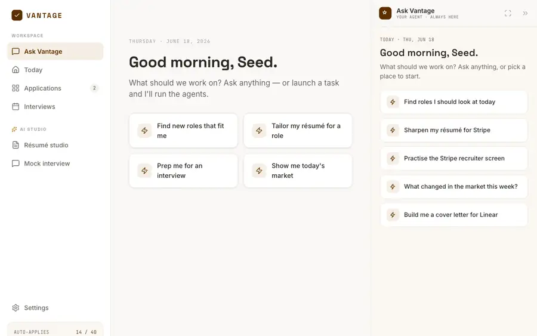
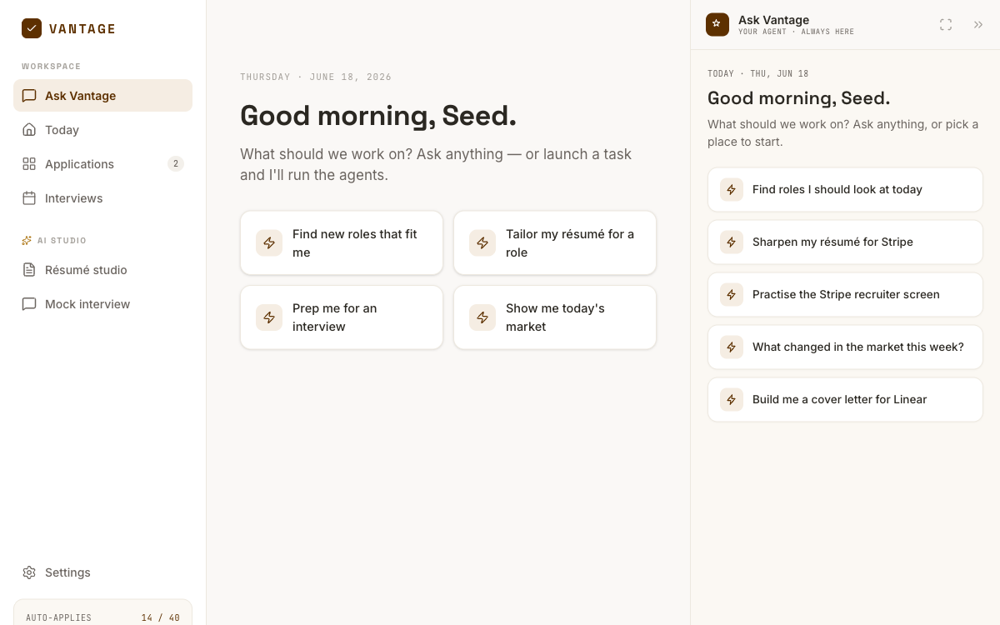
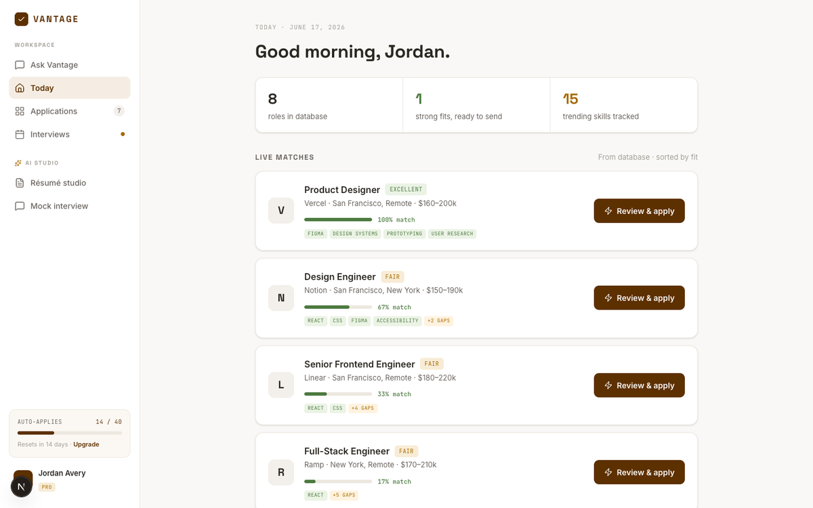
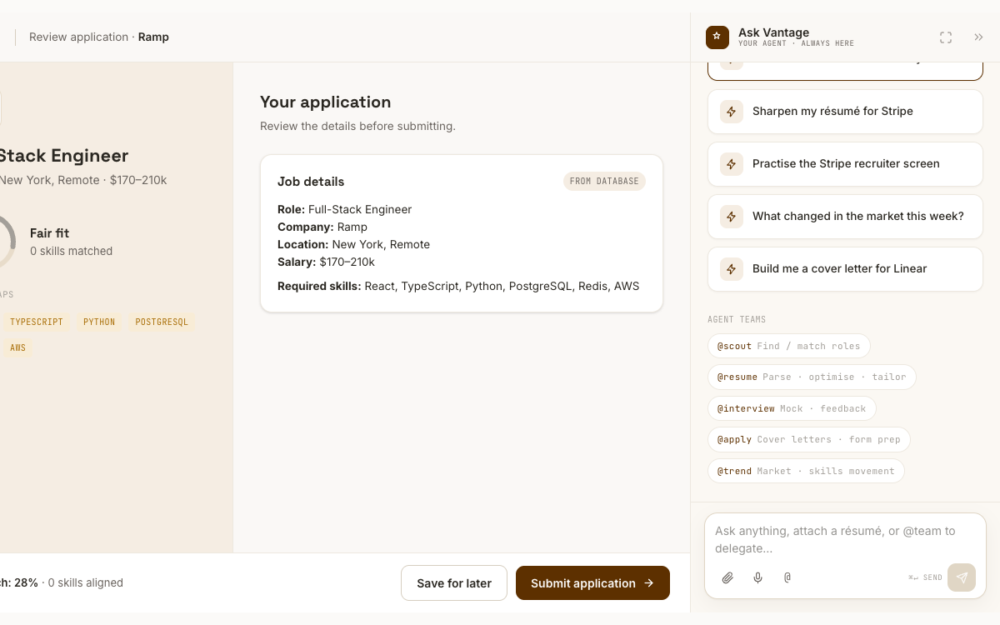
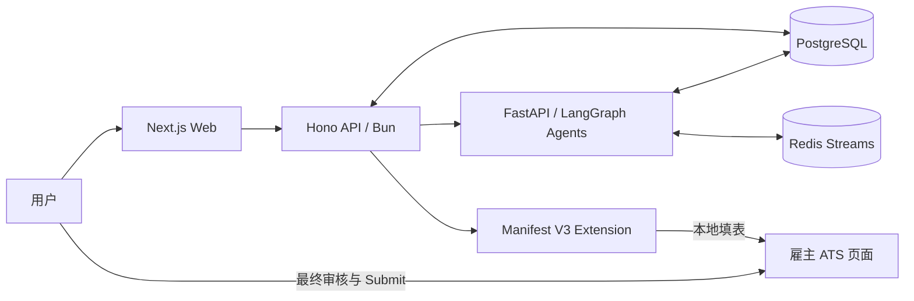

<div align="center">

# Relay

### 开源的 AI 求职执行系统

**让智能体找职位、定制简历、准备投递和面试。让人保留事实与最终提交权。**

[](https://github.com/getyak/apply-agent/actions/workflows/ci.yml)
[](https://github.com/getyak/apply-agent/actions/workflows/secrets-scan.yml)
[](LICENSE)
[](web/package.json)
[](agents/pyproject.toml)

[产品演示](#真实产品演示) · [核心机制](#它如何工作) · [本地运行](#本地运行) · [系统架构](#系统架构) · [文档](docs/README.md)

</div>

<p align="center">
  
</p>

<p align="center">
  <sub>真实界面录制：从 Ask Vantage 工作区，到匹配结果，再到投递包审核。</sub>
</p>

## Relay 是什么

Relay 是一套可以自托管的 AI 求职基础设施。仓库覆盖 Web 工作区、Hono API、FastAPI + LangGraph 智能体、PostgreSQL 数据层、Redis 事件流和 Manifest V3 浏览器扩展。

仓库里的用户界面当前使用 **Vantage** 品牌。可以把 Relay 理解为开源系统，把 Vantage 理解为这套系统的产品界面。

它不追求无差别批量投递。Relay 把最费脑的工作交给智能体，把不可逆的决定留给用户：

| 智能体负责 | 用户负责 |
|---|---|
| 解析真实履历，维护可追溯的 Career Graph | 审核事实变更 |
| 发现和排序更匹配的职位 | 决定值得投入的机会 |
| 定制简历、求职信和表单答案 | 接受、编辑或拒绝草稿 |
| 在浏览器中准备 ATS 字段 | 在雇主页面亲自点击最终 Submit |
| 生成面试练习和后续建议 | 记录真实结果与反馈 |

> 核心边界：不保存求职平台密码，不绕过 CAPTCHA，不编造经历，不在服务器端代替用户提交职位申请。

## 真实产品演示

<table>
  <tr>
    <td width="33.33%">
      
    </td>
    <td width="33.33%">
      
    </td>
    <td width="33.33%">
      
    </td>
  </tr>
  <tr>
    <td align="center"><sub>统一工作区：从一句请求启动职位、简历与面试智能体。</sub></td>
    <td align="center"><sub>实时职位匹配：把机会、契合度和技能缺口放在同一屏。</sub></td>
    <td align="center"><sub>投递前审核：职位证据、准备材料和智能体协作同时可见。</sub></td>
  </tr>
</table>

这些画面来自实际运行的 Next.js 产品界面，不是为 README 手工绘制的概念图。

## 它如何工作

1. **建立事实源**：导入简历，Relay 将证据暂存为 Career Graph 变更提案。
2. **人工确认事实**：用户审核 diff 后，事实才进入不可变版本历史。
3. **发现机会**：JobMatch Agent 读取公开职位源，解析 JD 并计算匹配。
4. **准备投递包**：Resume Agent 与 AppPrep Agent 生成定制简历、求职信和表单答案。
5. **浏览器内交付**：扩展在用户已有登录态、本机 IP 和真实浏览器中填充字段。
6. **用户最终提交**：最后一次 Submit 只能由用户在雇主页面确认。
7. **闭环学习**：投递和面试结果进入可审计历史，用于改进排序，不会反向改写事实。

## 为什么不是又一个 mass-apply bot

**事实有来源。** 简历只是编译产物，Career Graph 才是证据支持的事实源。AI 可以重述，不能发明。

**执行有边界。** 云端负责理解、生成和编排，客户端负责在用户浏览器中交付，最终提交始终是人的动作。

**每一步可恢复。** LangGraph checkpoint、事件流恢复、审计记录和明确的 HITL gate 让长任务可以暂停、审核和继续。

**结果进入闭环。** Relay 记录真实申请进度与面试结果，但把它们当作排序信号，不伪装成因果结论。

## 系统架构



| 层 | 技术 | 职责 |
|---|---|---|
| Web | Next.js 16, React 19, Tailwind CSS 4 | 工作区、Career Graph、简历、投递、面试与趋势 |
| API | Hono, Bun, PostgreSQL | 身份、业务 API、文件、事件转发与权限边界 |
| Agents | FastAPI, LangGraph, OpenRouter | Resume、JobMatch、Interview、AppPrep、Trend 与 Coordinator |
| Delivery | Chrome Manifest V3 extension | 本地字段识别、填充、审核和浏览器交付 |
| Data | PostgreSQL 16 + pgvector, Redis 7, MinIO | 事实、checkpoint、事件流、缓存与文件 |

TypeScript API 与 Python Agent 层只通过 HTTP、Redis 和共享 PostgreSQL 协作。智能体模型通过 OpenRouter 接入，不把某一家模型 API 写死进运行时。

## 本地运行

### 依赖

- Docker 与 Docker Compose
- [Bun](https://bun.sh/)
- [uv](https://docs.astral.sh/uv/)
- Python 3.11+

### 1. 准备环境

```bash
cp .env.example .env
# 编辑 .env，至少替换数据库、Redis、MinIO、JWT 与 OpenRouter 配置

make up
make db-health
```

本地基础设施使用 PostgreSQL `5433`、Redis `6380`、MinIO `9000/9001`，避免占用常见的默认端口。

### 2. 启动三个服务

```bash
# Terminal 1: API, http://localhost:3001
cd api
bun install
bun run dev
```

```bash
# Terminal 2: Agents, http://localhost:8000
cd agents
uv sync --all-extras
uv run uvicorn agents.api.server:app --reload --port 8000
```

```bash
# Terminal 3: Web, http://localhost:3000
cd web
bun install
bun run dev
```

浏览器扩展可以单独构建：

```bash
cd apps/extension
bun install
bun run build
```

## 验证

```bash
cd web && bun run lint && bun run typecheck
cd ../api && bun run typecheck && bun test
cd ../agents && uv run ruff check . && uv run pytest -m "not e2e"
```

CI 会按改动路径分流 Web、API、Agents、Extension、Infra 与 Eval 检查。迁移、权限 guard、扩展 manifest 和 GitHub workflow 还会进入额外保护流程。

## 仓库结构

```text
.
├── web/                 Next.js 产品与公开站点
├── api/                 Hono / Bun API
├── agents/              FastAPI / LangGraph 智能体与 MCP
├── apps/extension/      浏览器端交付扩展
├── infra/               PostgreSQL、Redis、MinIO 与迁移
├── eval/                Agent 回归评测与 scorecard
├── docs/                产品、架构、数据与安全文档
└── scripts/             健康检查、smoke test 与维护脚本
```

## 推荐阅读

- [产品愿景与原则](docs/vision.md)
- [产品规格](docs/product-spec.md)
- [系统总架构](docs/architecture/system-overview.md)
- [Agent Harness](docs/architecture/agent-harness.md)
- [Career Graph 架构](docs/architecture/codex-career-graph.md)
- [客户端交付方案](docs/architecture/client-side-delivery.md)
- [数据模型](docs/data-model.md)
- [隐私与安全](docs/privacy-security.md)

## 贡献

欢迎改进产品、智能体质量、ATS 适配、评测、可访问性和文档。提交前请阅读 [CONTRIBUTING.md](CONTRIBUTING.md) 与 [CODE_OF_CONDUCT.md](CODE_OF_CONDUCT.md)。

提交使用 Conventional Commits，例如 `feat:`、`fix:`、`docs:`、`refactor:`、`test:` 和 `chore:`。

## License

[MIT](LICENSE) © Relay contributors
